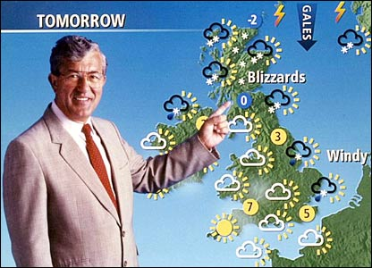
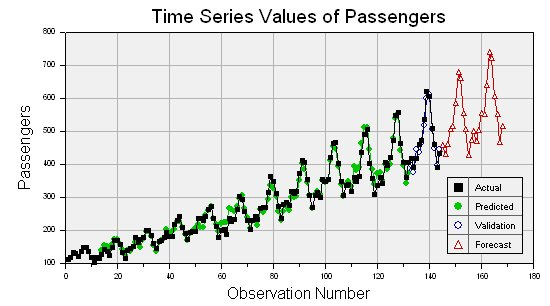
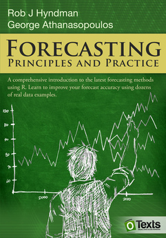
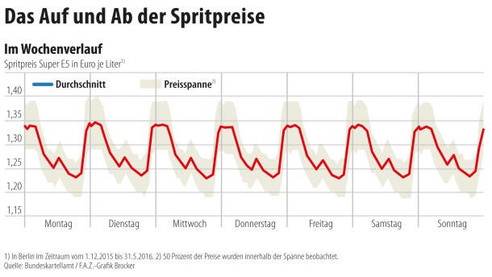
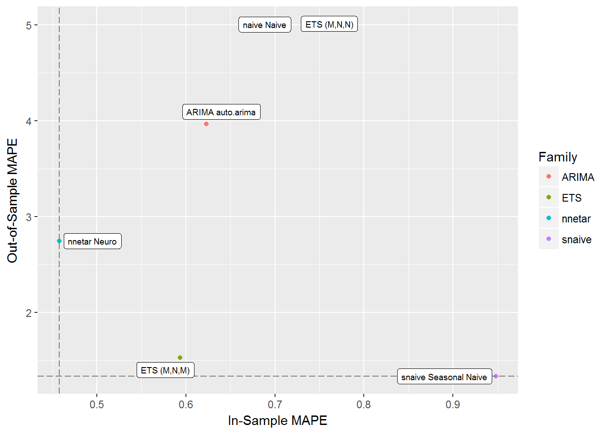

```{r setup, include=FALSE}
options(htmltools.dir.version = FALSE)
knitr::opts_chunk$set(collapse = TRUE, comment = "#>")
```


# Let's talk about *Forecasting*!

- Time Series data is *everywhere*! (especially in Business Settings)
- Forecasting ≈ Zeitreihenanalyse + Invariance Hypothesis
- Forecasting for S&OP-Planning
- Classical Stuff:ETS, Arima, Decompositions


►► **Robust, automatic forecasting is essential in practice!**

.pull-left[
```{r, out.height = "250px", echo = FALSE, fig.align='center'}

```
]
.pull-right[
```{r, out.height = "250px", echo = FALSE, fig.align='center'}

```
]


<!-- --- -->
<!-- background-image: url(/images/tanken_background.jpg) -->
<!-- background-size: cover -->
<!-- class: inverse, middle, center -->
<!-- # Spending too much money on gasoline? -->

---
background-image: url(/images/super_R.jpg)
background-size: 100px
background-position: 90% 8%
# Forecasting-Tools in *R*?
- CRAN Task View: [cran.r-project.org/web/views/TimeSeries.html](https://cran.r-project.org/web/views/TimeSeries.html)
- -> Dates, classes, univariate timeseries, regression, ...
- Different `ts` (`xts`, `timeseries`)-objects not standardized!

### A great introduction
.pull-left[
```{r, out.height = "250px", echo = FALSE, fig.align='left'}

```
[otexts.org/fpp](https://www.otexts.org/fpp)

]

.pull-right[
```{r, out.height = "250px", echo = FALSE, fig.align='left'}

```
[robjhyndman.com/](https://robjhyndman.com/)
]

???
How do we use R in our company-job? For Prototyping. (For Small Companies, who don't yet want to buy our tool or to try new state-of-the-art-techniques)

---
background-image: url(/images/tankerkoenig.png)
background-size: 100px
background-position: 90% 8%
# Application: Predicting Gas Prices

- from https://creativecommons.tankerkoenig.de/
- wouldn't it be nice to know what the sprit price is going to be next week?


???
it's a common understanding in the forecast-community, that you cannot forecast the oil-price trend.

---
background-image: url(images/drei_von_der_tankstelle_mem.jpg)
background-size: 900px
class: inverse, center

---
# Data-Exploration 1
- Trend
- Seasonality

```{r out.width='100%', fig.height=4, eval=require('dygraphs'), echo=FALSE}
{{library(dygraphs)}}
diesel_h <- readRDS("../data/diesel_h.RDS")
dygraph(diesel_h, main = "Gas Prices over time") %>% 
  dyRoller(rollPeriod = 1) %>% 
  dyRangeSelector()
```


???
- ACF und PACF erwähnen?
- wann benötigt man Differencing?


---
# Data-Exploration 2

https://anomaly.io/seasonal-trend-decomposition-in-r/

```{r, echo = FALSE}
attributes(diesel_h)$frequency <- 24 * 7
```

```{r, echo = FALSE, eval=require('forecast'), out.width='100%', fig.height=4, fig.align='center'}
ggseasonplot(as.ts(diesel_h),  year.labels = TRUE)
```

---
# Data-Exploration 3

```{r, echo = FALSE, fig.align='center', out.width='100%', fig.height=4, warning=FALSE}
ma_24 <- zoo::rollmean(diesel_h, 24, fill = list(NA, NULL, NA))
diesel_h_detrended <- diesel_h - ma_24
forecast::ggseasonplot(as.ts(diesel_h_detrended),  year.labels = TRUE)
```


---
# Data-Exploration 4

```{r, out.width = "700px", echo = FALSE, fig.align='center'}

```


---
background-image: url(images/tidyverse_background2.jpg)
background-size: cover
class: inverse, center
# Welcome to the *tidyverse*!
```{r, out.width = "800px", echo = FALSE, fig.align='center'}
knitr::include_graphics("images/tidyverse_workflow.png")
```

---
background-image: url(images/tidyforecast_workflow.png)
background-size: 700px
class: center

---
background-image: url(images/tidyforecast_sticker.png)
background-size: 80px
background-position: 90% 8%
# Nesting a dataframe*
```{r, eval = FALSE}
ets.models <- ets.params %>%
    # Add in the training set and the modelling function.
    mutate(fn = replicate(forecast::ets, n = n()),
           train = replicate(list(train), n = n())) %>%
    # Create a "param" column to pass to `fn`.
    mutate(params = purrr::transpose(list(
        "y" = train, "model" = model, "damped" = damped
    ))) %>%
    select(kind, desc, train, fn, params)
```

```{r, echo = FALSE}
readRDS("../data/models_ets.RDS")
```

.footnote[
[*] heavily inspired by http://unconj.ca/blog/forecasting-yyz-passengers-in-the-tidyverse.html (Aaron Jacobs)
]

---
background-image: url(images/tidyforecast_sticker.png)
background-size: 80px
background-position: 90% 8%
# Fitting many models
```{r, eval = FALSE}
forecast_all <- models_all %>%
  mutate(fit = purrr::invoke_map(fn, params),
         forecast = map(fit, forecast::forecast, h = h))
```

```{r, echo = FALSE, cache=TRUE}
readRDS("../data/forecast_all.RDS")
```

---
background-image: url(images/tidyforecast_sticker.png)
background-size: 80px
background-position: 90% 8%
# Model Evaluation 1👌
```{r, eval=FALSE}
forecast_all %>%
    mutate(test = replicate(list(test), n = n()),
           glance = map2(forecast, test, broom::glance))
```


```{r, echo = FALSE}
readRDS("../data/perf_all.RDS")
```

---
background-image: url(images/tidyforecast_sticker.png)
background-size: 80px
background-position: 90% 8%
# Model Evaluation 2
```{r, out.width = "500px", echo = FALSE, fig.align='center'}

```

---
background-image: url(images/drei_von_der_tankstelle2_mem.jpg)
background-size: cover

---
# Summary/ Discussion?

- What potential does this appoach have?
- What else could be done this way?

- How good is *R* as a forecasting tool? What is good about it? Where are challenges?

???
good: super flexible, a lot of methods, tidyverse!! ;)
challenges: ts-objects, runtime, learning-curve

---
## Forecasting challenges in practice
- many timeseries
- intermittend demand
- forecast value add-analysis
- error measures ("Zerrspiegel")

- "Once you have selected the right model, forecasting becomes easy!" (Prof. Stoffer)

---
# What else is out there?

.pull-left[
## Methods
- `prophet()`
- `forecast_xgb`
- `MLR::forecast()`
   https://rawgit.com/Stevo15025/mlrForcastingTutorial/gh-pages/forcasting_in_mlr.html
- `tidyquant`-package
- ensembling!
]

.pull-right[
## People
- Rob J. Hyndman
- Peter Ellis
  http://ellisp.github.io/blog/index_by_tag.html
- Nikolaos Kourentzes
  http://kourentzes.com/forecasting
]


---
class: inverse, center, middle
#Thank you for your attention!

Slides and code can be found on [github.com/henningsway/tidyforecasting](https://github.com/henningsway/tidyforecasting).

---
class: inverse, center, middle
background-image: url(images/nnet_background.jpg)
# Backup


---
# References
- github-repo for this talk: [github.com/user/foRcasting]()
- [Managing many models with R - Hadley Wickham (Youtube)](https://youtube.com/watch?v=rz3_FDVt9eg)


.pull-left[
```{r, echo = FALSE, fig.align='left'}
knitr::include_graphics("images/r4ds.png")
```
[r4ds.had.co.nz/many-models.html](http://r4ds.had.co.nz/many-models.html)
]

.pull-right[
```{r, echo = FALSE, fig.align='left'}

```
[hadley.nz/](http://hadley.nz/)
]


---
background-image: url(images/iqast_logo.png)
background-size: 230px
background-position: 90% 8%
# Data Science @ Iqast

.pull-left[
## Janko Thyson
```{r, out.width = "130px", echo = FALSE, fig.align='center'}

```
- [j.thyson@iqast.de](mailto:j.thyson@iqast.de)
- *+49 40 2093 1271 4*
- [github.com/rappster](https://github.com/rappster/)

]

.pull-right[
## Henning Bumann
```{r, out.width = "130px", echo = FALSE, fig.align='center'}

```
- [h.bumann@iqast.de](mailto:h.bumann@iqast.de)
- *+49 40 2093 3171 0*
- [github.com/henningsway](https://github.com/henningsway)
- [@henningsway](https://twitter.com/henningsway)
]

???
- Fotos sollten einheitlicher sein